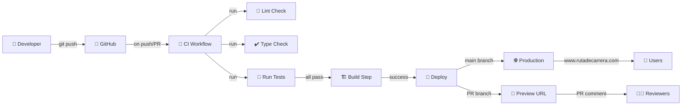

# 🚀 Ruta de Carrera Platform

> **Asistente de Empleabilidad con Gemini API**

Monorepo Next.js con 3 aplicaciones independientes (landing, asistente, test-disc) deployado en Vercel con CI/CD completamente automatizado.

---

## 📊 Status

| Component | Status |
|-----------|--------|
| **CI/CD** | [](https://github.com/esalinascl/rutadecarrera-platform/actions/workflows/ci.yml) |
| **Deploy** | [](https://github.com/esalinascl/rutadecarrera-platform/actions/workflows/deploy.yml) |

---

## 📁 Project Structure

```
rutadecarrera-platform/
├── apps/
│   ├── landing/          # Homepage y formulario de registro
│   ├── asistente/        # Chat UI + API Gemini
│   └── test-disc/        # Rueda de la Fundadora
├── packages/
│   └── shared/           # Tipos, utils, DB schema compartidos
├── .github/
│   ├── workflows/
│   │   ├── ci.yml        # Tests + Linting (cada push/PR)
│   │   └── deploy.yml    # Deploy automático a Vercel
│   └── pull_request_template.md
├── docs/
│   ├── deployment.md     # Guía de deployment (Este archivo)
│   ├── setup.md          # Instrucciones locales
│   └── api-reference.md  # Endpoints y schemas
└── package.json          # Root workspace config
```

---

## 🚀 Getting Started

### Prerequisites

- **Node.js:** 18.x o superior
- **pnpm:** 8.x o superior
- **Vercel Account:** https://vercel.com

### Local Setup

```bash
# 1. Clone repository
git clone https://github.com/esalinascl/rutadecarrera-platform.git
cd rutadecarrera-platform

# 2. Install dependencies
pnpm install

# 3. Configure environment variables
cp .env.example .env.local
# Edit .env.local with your Gemini API Key and Database URL

# 4. Start development server
pnpm dev

# 5. Open browser
# http://localhost:3000
```

---

## 📦 Scripts

```bash
# Development
pnpm dev              # Start all apps in development mode
pnpm dev:asistente   # Start only asistente app

# Building
pnpm build            # Build all apps and packages
pnpm build:asistente # Build specific app

# Testing
pnpm test             # Run tests across workspaces
pnpm test --watch    # Watch mode

# Quality
pnpm lint             # Run ESLint
pnpm lint:fix         # Auto-fix issues
pnpm typecheck        # TypeScript type checking
```

---

## 🔄 CI/CD Pipeline

### Automatic Workflows

Every push triggers:



### Workflow 1: CI (`ci.yml`)

**Trigger:** Push to `main`/`develop`, Pull Requests

**Steps:**
1. Checkout code
2. Setup Node.js (18.x, 20.x matrix)
3. Install dependencies (pnpm)
4. Run linter (ESLint)
5. Type checking (TypeScript)
6. Run tests (Jest) + coverage
7. Upload coverage report
8. Comment PR with results

**Duration:** ~2-3 minutes

### Workflow 2: Deploy (`deploy.yml`)

**Trigger:** Push to `main` (production), Pull Requests (preview)

**Steps:**
1. Checkout code
2. Setup Node.js 20.x
3. Install Vercel CLI
4. Build project artifacts
5. If `main`: Deploy to production
6. If PR: Create preview deployment
7. Comment PR with preview URL

**Duration:** ~3-5 minutes

---

## 📚 Deployment Guide

### Full Documentation

See [**docs/deployment.md**](./docs/deployment.md) for:
- Detailed Vercel setup instructions
- Github Secrets configuration
- Environment variables guide
- Troubleshooting common issues
- Rollback procedures
- Security best practices

### Quick Links

- **Production URL:** https://rutadecarrera.com
- **Vercel Dashboard:** https://vercel.com/dashboard
- **Github Actions:** https://github.com/esalinascl/rutadecarrera-platform/actions
- **API Reference:** [docs/api-reference.md](./docs/api-reference.md)

---

## 🔐 Security

### Environment Variables

**Local Development (.env.local):**
```bash
GEMINI_API_KEY=your_key_here
DATABASE_URL=postgresql://...
NEXT_PUBLIC_APP_URL=http://localhost:3000
NODE_ENV=development
```

**Production (Vercel):**
- Set via Vercel dashboard environment variables
- Secrets stored in Github Actions

### Best Practices

✅ Never commit `.env.local`  
✅ Use `.gitignore` for sensitive files  
✅ Rotate API keys regularly  
✅ Use branch protection on `main`  
✅ Require PR reviews before merge  

---

## 🧪 Testing

### Run Tests

```bash
# All workspaces
pnpm test

# Watch mode
pnpm test --watch

# Coverage report
pnpm test --coverage

# Specific app
pnpm test --workspaces --filter asistente
```

### Coverage Requirements

- **Critical paths:** 80%+
- **UI Components:** 60%+
- **Utils:** 85%+

---

## 📖 Documentation

| Document | Purpose |
|----------|---------|
| [docs/deployment.md](./docs/deployment.md) | Vercel + Github Actions setup guide |
| [docs/setup.md](./docs/setup.md) | Local development instructions |
| [docs/api-reference.md](./docs/api-reference.md) | API endpoints and schemas |

---

## 🤝 Contributing

1. Create feature branch: `git checkout -b feat/my-feature`
2. Make changes and test locally: `pnpm dev`
3. Commit with conventional messages: `git commit -m "feat: description"`
4. Push and create Pull Request
5. Wait for CI checks to pass
6. Request review and merge

See [CONTRIBUTING.md](./CONTRIBUTING.md) for detailed guidelines.

---

## 📝 Tech Stack

| Component | Technology |
|-----------|------------|
| **Frontend** | Next.js 14, React 18 |
| **Backend** | Next.js API Routes |
| **AI Integration** | Google Gemini API |
| **Database** | PostgreSQL (Supabase) |
| **Deployment** | Vercel |
| **CI/CD** | Github Actions |
| **Package Manager** | pnpm workspaces |
| **Language** | TypeScript |
| **Testing** | Jest + Supertest |

---

## 🐛 Troubleshooting

### Common Issues

**Q: `pnpm install` fails**
```bash
# Clear cache and retry
rm -rf node_modules pnpm-lock.yaml
pnpm install
```

**Q: CI workflow fails but tests pass locally**
```bash
# Ensure using same Node version as CI
nvm use 20
pnpm test --workspaces --coverage
```

**Q: Preview deployment not created**
- Check Github Actions logs
- Ensure Vercel secrets are configured
- Verify PR is to `main` branch

See [docs/deployment.md#troubleshooting](./docs/deployment.md#troubleshooting) for more.

---

## 📞 Support

- **Issues:** https://github.com/esalinascl/rutadecarrera-platform/issues
- **Discussions:** https://github.com/esalinascl/rutadecarrera-platform/discussions
- **Owner:** Eduardo Salinas Belletti (eduardo.salinasb@gmail.com)

---

## 📄 License

MIT License - See [LICENSE](./LICENSE) file

---

## 🎯 Roadmap

### Phase 1: Setup ✅
- [x] Monorepo structure
- [x] CI/CD pipelines
- [ ] Database schema

### Phase 2: Backend
- [ ] Gemini API integration
- [ ] Chat endpoint (`/api/chat`)
- [ ] Message persistence

### Phase 3: Frontend
- [ ] Chat UI component
- [ ] Message history
- [ ] User authentication

### Phase 4: Analysis
- [ ] Career analysis
- [ ] Recommendations engine
- [ ] Report generation

### Phase 5: Polish
- [ ] E2E tests
- [ ] Performance optimization
- [ ] Security audit

### Phase 6: Launch
- [ ] Production deployment
- [ ] Monitoring setup
- [ ] Documentation

---

**Last Updated:** 2026-09-24  
**Maintained by:** Claude Code  
**Owner:** Eduardo Salinas Belletti
