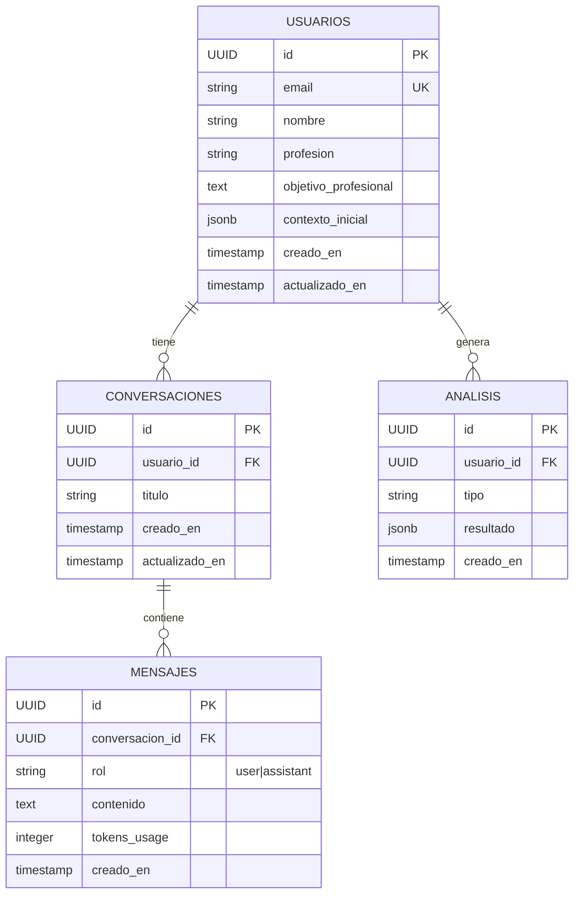

# 📊 Database Schema - Asistente de Empleabilidad

> **Proyecto:** rutadecarrera-platform  
> **Versión:** 1.0  
> **Estado:** Active  
> **Última actualización:** 2026-09-24

---

## 📖 Descripción General

El schema de base de datos soporta un asistente de IA para coaching de transición profesional. Los datos persisten en **Supabase** (PostgreSQL), con las siguientes tablas principales:

- **usuarios**: Perfiles de usuarios del asistente
- **conversaciones**: Sesiones de chat entre usuario y asistente
- **mensajes**: Mensajes individuales dentro de conversaciones
- **analisis**: Resultados de análisis de empleabilidad

---

## 🗂️ Diagrama ER (Entidad-Relación)



---

## 📋 Tabla: `usuarios`

Almacena información de perfil de cada usuario del asistente.

### Campos

| Campo | Tipo | Constraint | Descripción |
|-------|------|-----------|-------------|
| `id` | UUID | PRIMARY KEY | Identificador único generado automáticamente |
| `email` | VARCHAR(255) | UNIQUE, NOT NULL | Email único del usuario |
| `nombre` | VARCHAR(255) | NOT NULL | Nombre completo del usuario |
| `profesion` | VARCHAR(255) | NULLABLE | Profesión actual del usuario |
| `objetivo_profesional` | TEXT | NULLABLE | Objetivo de carrera en formato libre |
| `contexto_inicial` | JSONB | NULLABLE | Contexto inicial capturado en el formulario (JSON) |
| `creado_en` | TIMESTAMP | DEFAULT NOW() | Timestamp de creación |
| `actualizado_en` | TIMESTAMP | DEFAULT NOW() | Timestamp de última actualización |

### Índices

```sql
CREATE INDEX idx_usuarios_email ON usuarios(email);
```

### Ejemplo de Datos

```json
{
  "id": "550e8400-e29b-41d4-a716-446655440000",
  "email": "jose@example.com",
  "nombre": "José García",
  "profesion": "Ingeniero de Software",
  "objetivo_profesional": "Transitar a liderazgo técnico en 2026",
  "contexto_inicial": {
    "años_experiencia": 8,
    "sector": "Fintech",
    "retos_principales": ["Gestión de equipos", "Visión estratégica"]
  },
  "creado_en": "2026-09-24T10:30:00Z",
  "actualizado_en": "2026-09-24T10:30:00Z"
}
```

---

## 📋 Tabla: `conversaciones`

Almacena sesiones de chat entre usuario y asistente.

### Campos

| Campo | Tipo | Constraint | Descripción |
|-------|------|-----------|-------------|
| `id` | UUID | PRIMARY KEY | Identificador único de conversación |
| `usuario_id` | UUID | FOREIGN KEY, NOT NULL | Referencia a `usuarios.id` (ON DELETE CASCADE) |
| `titulo` | VARCHAR(255) | NULLABLE | Título descriptivo de la conversación |
| `creado_en` | TIMESTAMP | DEFAULT NOW() | Timestamp de creación |
| `actualizado_en` | TIMESTAMP | DEFAULT NOW() | Timestamp de última actualización |

### Índices

```sql
CREATE INDEX idx_conversaciones_usuario_id ON conversaciones(usuario_id);
CREATE INDEX idx_conversaciones_creado_en ON conversaciones(creado_en);
```

### Constraints

- **Foreign Key:** `usuario_id` → `usuarios.id` con `ON DELETE CASCADE`
- Eliminar un usuario elimina todas sus conversaciones

### Ejemplo de Datos

```json
{
  "id": "660e8400-e29b-41d4-a716-446655440001",
  "usuario_id": "550e8400-e29b-41d4-a716-446655440000",
  "titulo": "Planificación de transición a liderazgo",
  "creado_en": "2026-09-24T10:35:00Z",
  "actualizado_en": "2026-09-24T10:35:00Z"
}
```

---

## 📋 Tabla: `mensajes`

Almacena mensajes individuales dentro de cada conversación.

### Campos

| Campo | Tipo | Constraint | Descripción |
|-------|------|-----------|-------------|
| `id` | UUID | PRIMARY KEY | Identificador único de mensaje |
| `conversacion_id` | UUID | FOREIGN KEY, NOT NULL | Referencia a `conversaciones.id` (ON DELETE CASCADE) |
| `rol` | VARCHAR(20) | CHECK, NOT NULL | Rol del emisor: 'user' o 'assistant' |
| `contenido` | TEXT | NOT NULL | Contenido del mensaje |
| `tokens_usage` | INTEGER | NULLABLE | Tokens consumidos de Gemini API (para tracking) |
| `creado_en` | TIMESTAMP | DEFAULT NOW() | Timestamp de creación |

### Índices

```sql
CREATE INDEX idx_mensajes_conversacion_id ON mensajes(conversacion_id);
CREATE INDEX idx_mensajes_creado_en ON mensajes(creado_en);
```

### Constraints

- **Foreign Key:** `conversacion_id` → `conversaciones.id` con `ON DELETE CASCADE`
- **CHECK:** `rol IN ('user', 'assistant')`
- Eliminar una conversación elimina todos sus mensajes

### Ejemplo de Datos

```json
[
  {
    "id": "770e8400-e29b-41d4-a716-446655440002",
    "conversacion_id": "660e8400-e29b-41d4-a716-446655440001",
    "rol": "user",
    "contenido": "¿Cuáles son los pasos para hacer una transición a liderazgo técnico?",
    "tokens_usage": null,
    "creado_en": "2026-09-24T10:36:00Z"
  },
  {
    "id": "880e8400-e29b-41d4-a716-446655440003",
    "conversacion_id": "660e8400-e29b-41d4-a716-446655440001",
    "rol": "assistant",
    "contenido": "Para transitar a liderazgo técnico, recomiendo estos pasos...",
    "tokens_usage": 234,
    "creado_en": "2026-09-24T10:37:00Z"
  }
]
```

---

## 📋 Tabla: `analisis`

Almacena resultados de análisis de empleabilidad generados por el sistema.

### Campos

| Campo | Tipo | Constraint | Descripción |
|-------|------|-----------|-------------|
| `id` | UUID | PRIMARY KEY | Identificador único de análisis |
| `usuario_id` | UUID | FOREIGN KEY, NOT NULL | Referencia a `usuarios.id` (ON DELETE CASCADE) |
| `tipo` | VARCHAR(50) | NULLABLE | Tipo de análisis (e.g., 'skills', 'gaps', 'recommendations') |
| `resultado` | JSONB | NULLABLE | Resultado del análisis en formato JSON |
| `creado_en` | TIMESTAMP | DEFAULT NOW() | Timestamp de creación |

### Índices

```sql
CREATE INDEX idx_analisis_usuario_id ON analisis(usuario_id);
CREATE INDEX idx_analisis_creado_en ON analisis(creado_en);
```

### Constraints

- **Foreign Key:** `usuario_id` → `usuarios.id` con `ON DELETE CASCADE`
- Eliminar un usuario elimina todos sus análisis

### Ejemplo de Datos

```json
{
  "id": "990e8400-e29b-41d4-a716-446655440004",
  "usuario_id": "550e8400-e29b-41d4-a716-446655440000",
  "tipo": "skills",
  "resultado": {
    "fortalezas": [
      "Pensamiento estratégico",
      "Comunicación clara",
      "Experiencia técnica"
    ],
    "brechas": [
      "Gestión de presupuestos",
      "Coaching a individuos"
    ],
    "recomendaciones": [
      "Tomar curso de gestión financiera",
      "Buscar mentor en liderazgo"
    ]
  },
  "creado_en": "2026-09-24T10:40:00Z"
}
```

---

## 🔗 Relaciones

### 1. Usuario → Conversaciones (One-to-Many)

- Un usuario puede tener múltiples conversaciones
- Cuando se elimina un usuario, todas sus conversaciones se eliminan (ON DELETE CASCADE)

**Query de ejemplo:**

```sql
SELECT c.* FROM conversaciones c
WHERE c.usuario_id = '550e8400-e29b-41d4-a716-446655440000'
ORDER BY c.creado_en DESC;
```

### 2. Conversación → Mensajes (One-to-Many)

- Una conversación puede tener múltiples mensajes
- Cuando se elimina una conversación, todos sus mensajes se eliminan (ON DELETE CASCADE)

**Query de ejemplo:**

```sql
SELECT m.* FROM mensajes m
WHERE m.conversacion_id = '660e8400-e29b-41d4-a716-446655440001'
ORDER BY m.creado_en ASC;
```

### 3. Usuario → Análisis (One-to-Many)

- Un usuario puede tener múltiples análisis
- Cuando se elimina un usuario, todos sus análisis se eliminan (ON DELETE CASCADE)

**Query de ejemplo:**

```sql
SELECT a.* FROM analisis a
WHERE a.usuario_id = '550e8400-e29b-41d4-a716-446655440000'
ORDER BY a.creado_en DESC;
```

---

## 🚀 Cómo Ejecutar Migrations

### Opción 1: Usando Supabase UI

1. Ir a **SQL Editor** en Supabase dashboard
2. Crear una nueva query
3. Copiar el contenido de `packages/shared/db/migrations/001_init_schema.sql`
4. Ejecutar la query

### Opción 2: Usando Supabase CLI

```bash
# Instalar Supabase CLI (si no está instalado)
npm install -g supabase

# Autenticarse
supabase login

# Ejecutar migrations
supabase db push
```

### Opción 3: Desde Node.js (en desarrollo)

```typescript
import { initSupabaseDatabase } from '@rcp/db';

async function runMigrations() {
  const dbClient = await initSupabaseDatabase();
  // Las migrations se aplican al conectar
  console.log('✓ Schema inicializado');
}

runMigrations();
```

---

## 💻 Cómo Conectarse desde Node.js

### Configuración de Entorno

Crear `.env.local`:

```env
SUPABASE_URL=https://xxxxx.supabase.co
SUPABASE_ANON_KEY=xxxxx
```

### Inicializar Cliente

```typescript
import { initSupabaseDatabase, getRepositories } from '@rcp/db';

// Inicializar base de datos
const dbClient = await initSupabaseDatabase();

// Usar repositorios
const repositories = getRepositories();

// Crear usuario
const usuario = await repositories.usuarios.create({
  email: 'jose@example.com',
  nombre: 'José García',
  profesion: 'Ingeniero de Software',
});

// Buscar usuario por email
const found = await repositories.usuarios.findByEmail('jose@example.com');

// Crear conversación
const conversacion = await repositories.conversaciones.create({
  usuario_id: usuario.id,
  titulo: 'Primera conversación',
});

// Crear mensaje
const mensaje = await repositories.mensajes.create({
  conversacion_id: conversacion.id,
  rol: 'user',
  contenido: '¿Cómo puedo mejorar mis habilidades de liderazgo?',
});

// Buscar mensajes de una conversación
const mensajes = await repositories.mensajes.findByConversacionId(
  conversacion.id
);
```

---

## ⚡ Performance & Optimizations

### Índices Creados

| Tabla | Índice | Propósito |
|-------|--------|----------|
| `usuarios` | `idx_usuarios_email` | Búsquedas rápidas por email |
| `conversaciones` | `idx_conversaciones_usuario_id` | Listar conversaciones de un usuario |
| `conversaciones` | `idx_conversaciones_creado_en` | Ordenar por fecha de creación |
| `mensajes` | `idx_mensajes_conversacion_id` | Obtener mensajes de una conversación |
| `mensajes` | `idx_mensajes_creado_en` | Paginación temporal de mensajes |
| `analisis` | `idx_analisis_usuario_id` | Listar análisis de un usuario |
| `analisis` | `idx_analisis_creado_en` | Ordenar análisis por fecha |

### Queries Optimizadas

1. **Listar conversaciones de un usuario (con orden):**
   ```sql
   SELECT * FROM conversaciones 
   WHERE usuario_id = $1 
   ORDER BY creado_en DESC
   LIMIT 20;
   ```
   Usa: `idx_conversaciones_usuario_id`, `idx_conversaciones_creado_en`

2. **Obtener historial de una conversación:**
   ```sql
   SELECT * FROM mensajes 
   WHERE conversacion_id = $1 
   ORDER BY creado_en ASC;
   ```
   Usa: `idx_mensajes_conversacion_id`

3. **Buscar usuario por email:**
   ```sql
   SELECT * FROM usuarios WHERE email = $1;
   ```
   Usa: `idx_usuarios_email` (unique index)

---

## 🔒 Seguridad

### Constraints

- ✅ **Unique Email:** Previene duplicación de cuentas
- ✅ **Foreign Keys con CASCADE:** Integridad referencial automática
- ✅ **CHECK Constraint en `rol`:** Solo permite 'user' o 'assistant'
- ✅ **UUID Primarias:** Imposible predecir IDs

### Recomendaciones

1. **Row Level Security (RLS):** Implementar políticas Supabase RLS
   ```sql
   ALTER TABLE usuarios ENABLE ROW LEVEL SECURITY;
   CREATE POLICY "Users can view own data"
   ON usuarios
   FOR SELECT
   USING (auth.uid()::text = id);
   ```

2. **API Keys:** Usar `SUPABASE_ANON_KEY` en frontend, `SUPABASE_SERVICE_KEY` en backend

3. **Rate Limiting:** Implementar en API routes (ver TASK 5)

---

## 📊 Estadísticas de Schema

| Métrica | Valor |
|---------|-------|
| Total Tablas | 4 |
| Total Campos | 25 |
| Total Índices | 7 |
| Foreign Keys | 3 |
| Constraints | 5+ |

---

## 🔄 Próximos Pasos

- [ ] TASK 4: Crear tipos compartidos + utils
- [ ] TASK 5: Endpoint POST /api/chat
- [ ] TASK 6: Integrar Gemini API
- [ ] Implementar Row Level Security (RLS)
- [ ] Agregar políticas de auditoría
- [ ] Configurar backups automáticos en Supabase

---

## 📚 Referencias

- [Supabase Documentation](https://supabase.com/docs)
- [PostgreSQL Documentation](https://www.postgresql.org/docs/)
- [TASK 3: Setup Supabase + Database Schema](../TASKS-Asistente-Empleabilidad.md#task-3)

---

**Última actualización:** 2026-09-24  
**Responsable:** Eduardo Salinas Belletti + Claude Code  
**Estado:** ✅ Active
