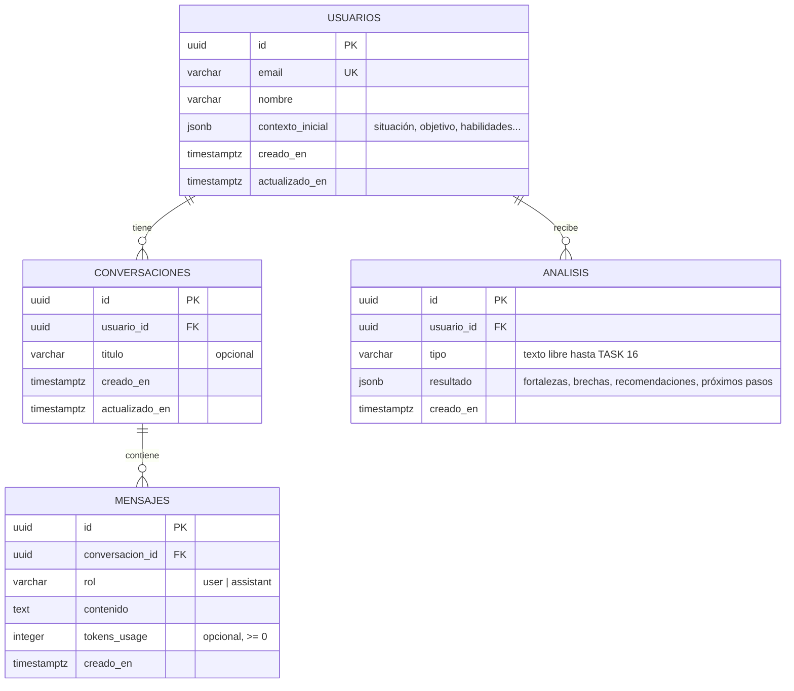

# Esquema de base de datos

PostgreSQL en Supabase. Modelo de datos definido en la SPEC del Asistente de Empleabilidad.

## Fuente única de verdad

| Qué | Dónde | Rol |
|---|---|---|
| Esquema real | `packages/shared/src/db/migrations/001_init_schema.sql` | **Fuente de verdad.** Lo que existe en la base. |
| Entidades TypeScript | `packages/shared/src/types/index.ts` | Reflejan cada tabla columna por columna. |
| Validación Zod | `packages/shared/src/utils/validation.ts` | Atada a las entidades con `satisfies`: si difieren, no compila. |
| Guardia de consistencia | `packages/shared/src/__tests__/db-schema.test.ts` | Lee el SQL y lo compara con los tipos: si difieren, el test falla. |

Para cambiar el esquema: nueva migración (`002_...sql`) + actualizar entidades + `COLUMNAS_POR_TABLA`. Los tests avisan si falta alguno de los tres.

## Diagrama



## Decisiones de diseño

- **Fechas `TIMESTAMPTZ`.** Supabase las entrega como texto ISO 8601 (`IsoDateString` en TypeScript). No se usa `Date` en los tipos porque no sobrevive a JSON.
- **El contexto del formulario va en `contexto_inicial` (JSONB)**, no en columnas sueltas: el formulario puede evolucionar sin migraciones.
- **Borrado en cascada.** Borrar un usuario borra sus conversaciones, mensajes y análisis (necesario para el derecho de eliminación de datos).
- **Mensajes y análisis inmutables.** Sus repositorios no exponen `update` ni `delete` individual: el historial no se reescribe.
- **Índices:** `usuario_id` y `conversacion_id` para las consultas por dueño; `creado_en` para ordenar. `email` ya tiene índice por ser `UNIQUE`.

## Seguridad: Row Level Security

RLS está **activado en las 4 tablas y sin políticas**. Efecto:

- La clave pública (`anon`) **no puede leer ni escribir nada**.
- Solo el backend, con `SUPABASE_SERVICE_ROLE_KEY`, accede a los datos. Por eso `@rcp/shared/db` se niega a ejecutarse en el navegador.

Las políticas por usuario se agregan en la **TASK 9 (autenticación)**, antes de permitir cualquier acceso desde el navegador.

## Aplicar la migración

La migración es repetible (`IF NOT EXISTS`): ejecutarla dos veces no rompe nada.

1. Supabase → proyecto **staging** → SQL Editor.
2. Pegar el contenido de `001_init_schema.sql` y ejecutar.
3. Verificar en Table Editor que existen las 4 tablas con el candado de RLS activo.
4. Repetir en **producción** solo después de mergear a `main`.

## Uso desde el servidor

```ts
// Solo en API routes o server actions
import { leerConfigSupabase, crearClienteSupabase, crearRepositorios } from '@rcp/shared/db';

const repos = crearRepositorios(crearClienteSupabase(leerConfigSupabase()));
const historial = await repos.mensajes.findByConversacionId(conversacionId); // orden cronológico
```

Todo error de Supabase se lanza como `DatabaseError` con la operación que falló (`usuarios.create`, etc.). Ninguno se silencia.
