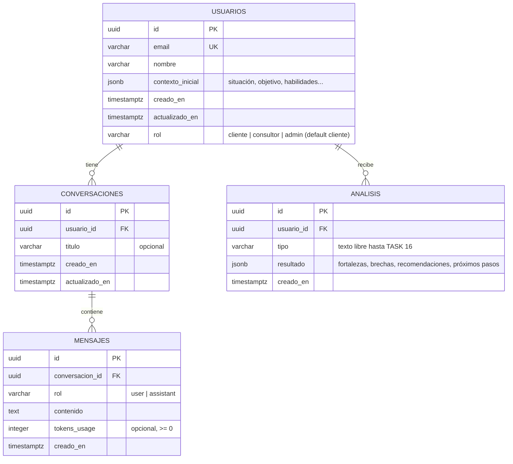

# Esquema de base de datos

PostgreSQL en Supabase. Modelo de datos definido en la SPEC del Asistente de Empleabilidad.

## Fuente única de verdad

| Qué | Dónde | Rol |
|---|---|---|
| Esquema real | `packages/shared/src/db/migrations/` (`001_init_schema.sql` crea las tablas; `003_auth_rls.sql` agrega `rol`, el vínculo con `auth.users` y las políticas RLS) | **Fuente de verdad.** Lo que existe en la base. |
| Entidades TypeScript | `packages/shared/src/types/index.ts` | Reflejan cada tabla columna por columna. |
| Validación Zod | `packages/shared/src/utils/validation.ts` | Atada a las entidades con `satisfies`: si difieren, no compila. |
| Guardia de consistencia | `packages/shared/src/__tests__/db-schema.test.ts` | Lee el SQL y lo compara con los tipos: si difieren, el test falla. |

Para cambiar el esquema: nueva migración (`NNN_...sql`) + actualizar entidades + `COLUMNAS_POR_TABLA`. Los tests avisan si falta alguno de los tres. La guardia lee **todas** las migraciones en orden (columnas de `CREATE TABLE` más las de `ALTER TABLE ... ADD COLUMN IF NOT EXISTS`).

## Diagrama


```mermaid
erDiagram
    USUARIOS ||--o{ CONVERSACIONES : "tiene"
    USUARIOS ||--o{ ANALISIS : "recibe"
    CONVERSACIONES ||--o{ MENSAJES : "contiene"

    USUARIOS {
        uuid id PK
        varchar email UK
        varchar nombre
        jsonb contexto_inicial "situación, objetivo, habilidades..."
        timestamptz creado_en
        timestamptz actualizado_en
        varchar rol "cliente | consultor | admin (default cliente)"
    }
    CONVERSACIONES {
        uuid id PK
        uuid usuario_id FK
        varchar titulo "opcional"
        timestamptz creado_en
        timestamptz actualizado_en
    }
    MENSAJES {
        uuid id PK
        uuid conversacion_id FK
        varchar rol "user | assistant"
        text contenido
        integer tokens_usage "opcional, >= 0"
        timestamptz creado_en
    }
    ANALISIS {
        uuid id PK
        uuid usuario_id FK
        varchar tipo "texto libre hasta TASK 16"
        jsonb resultado "fortalezas, brechas, recomendaciones, próximos pasos"
        timestamptz creado_en
    }
```

## Decisiones de diseño

- **Fechas `TIMESTAMPTZ`.** Supabase las entrega como texto ISO 8601 (`IsoDateString` en TypeScript). No se usa `Date` en los tipos porque no sobrevive a JSON.
- **El contexto del formulario va en `contexto_inicial` (JSONB)**, no en columnas sueltas: el formulario puede evolucionar sin migraciones.
- **Borrado en cascada.** Borrar un usuario borra sus conversaciones, mensajes y análisis (necesario para el derecho de eliminación de datos).
- **Mensajes y análisis inmutables.** Sus repositorios no exponen `update` ni `delete` individual: el historial no se reescribe.
- **Índices:** `usuario_id` y `conversacion_id` para las consultas por dueño; `creado_en` para ordenar. `email` ya tiene índice por ser `UNIQUE`.

## Seguridad: Row Level Security, roles y privilegios

Decisiones: AD-9 → A (solo roles) y AD-10 → B1 («cada dueño ve lo suyo»). Resumen en [`decisions/003-rls-y-roles.md`](decisions/003-rls-y-roles.md).

Hay **dos capas** y las dos son necesarias:

- **RLS** decide **qué filas** ve o toca cada usuario.
- **GRANT por columna** decide **qué columnas** puede escribir. Así nadie cambia su `rol`, su `email`, el dueño de una conversación ni el consumo (`tokens_usage`).

### Roles de base de datos

| Rol | Qué puede |
|---|---|
| `anon` (sin sesión) | **Nada.** Sin privilegios ni políticas en las 4 tablas. |
| `authenticated` (con sesión) | Solo sus propias filas, según la tabla de abajo. |
| `service_role` (solo servidor) | Todo, ignora RLS. Para créditos, pagos y administración. |

### Qué puede hacer un usuario con sesión (`authenticated`)

| Tabla | Leer | Crear | Modificar | Borrar |
|---|---|---|---|---|
| `usuarios` | Su fila | — (la crea el trigger al registrarse) | Solo `nombre` y `contexto_inicial` (`actualizado_en` lo marca la base) | — |
| `conversaciones` | Las suyas | Con su `usuario_id` (`usuario_id`, `titulo`) | Solo `titulo` (`actualizado_en` lo marca la base) | — |
| `mensajes` | Los de sus conversaciones | En sus conversaciones (`conversacion_id`, `rol`, `contenido`) — **no** `tokens_usage` | — | — |
| `analisis` | Los suyos | Con su `usuario_id` | — | — |

«—» = no permitido desde el navegador. Si una TASK necesita más (p. ej. borrar conversaciones), agrega su propia política y su propio test.

### Registro de usuarios

Al crearse una cuenta en `auth.users`, el trigger `al_registrarse_crear_usuario` crea la fila en `usuarios` con rol **`cliente`**. Ignora cualquier `rol` que venga en los metadatos del registro (los controla el usuario). Para subir a alguien a `consultor` o `admin` hay que usar `service_role` o el SQL Editor.

- **Sin email no hay registro:** se rechaza con un mensaje claro. Hoy solo existe acceso por Magic Link, que siempre trae email; si se habilita teléfono o acceso anónimo hay que revisar `usuarios.email`.
- **Nombre:** viene de los metadatos o de la parte local del email, recortado a 255 caracteres.
- **Email al día:** si cambia en `auth.users`, el trigger `al_cambiar_email_sincronizar_usuario` lo copia a `usuarios.email`.
- **Los usuarios no se crean desde el código**, por eso `UsuarioRepository` no tiene `create`. Tampoco hay que borrar solo `usuarios.id`: la cuenta vive en `auth.users` (borrarla elimina en cascada todo lo del usuario).

### Funciones y tablas futuras

- Las 3 funciones de la migración (`crear_usuario_al_registrarse`, `sincronizar_email_usuario`, `marcar_actualizado_en`) **no son ejecutables** por `anon`, `authenticated` ni `service_role`: solo las disparan los triggers.
- Las **tablas y secuencias nuevas** que cree quien migra nacen **sin privilegios** para `anon` y `authenticated`. Cada tabla nueva debe traer su `GRANT`, su RLS y sus políticas (con test). Las **funciones** nuevas no se tocaron: quien cree una para usarla desde la API debe decidir su `EXECUTE`.

### Puntos abiertos (se resuelven en su TASK)

- `mensajes.rol` (`user`/`assistant`): hoy el usuario puede insertar ambos valores en sus propias conversaciones. La TASK 7/12 decide si las respuestas del asistente se escriben solo con `service_role`.
- Acceso del consultor a sus clientes (AD-10 → B2): no existe aún.
- `analisis.tipo` y `analisis.resultado` los escribe libremente el dueño: si algún día se factura o se rankea con ellos, la escritura debe pasar a `service_role`.

## Aplicar la migración

La migración es repetible (`IF NOT EXISTS`): ejecutarla dos veces no rompe nada.

1. Supabase → proyecto **staging** → SQL Editor.
2. Pegar el contenido de la migración y ejecutar (`001` si la base está vacía; luego `003`).
3. Verificar: 4 tablas con RLS activo, columna `usuarios.rol`, 9 políticas y 4 triggers nuevos (2 sobre auth.users y 1 de fecha en usuarios y otro en conversaciones). Ejecutarla **dos veces** (es repetible) y revisar el linter de seguridad de Supabase.
4. Repetir en **producción** solo después de mergear a `main` y con autorización explícita de Eduardo.

Las pruebas automáticas de RLS (`rls.test.ts`) corren sobre Postgres en memoria (PGlite) con un Supabase emulado, así que **no reemplazan** la verificación en staging.

## Uso desde el servidor

```ts
// Solo en API routes o server actions
import { leerConfigSupabase, crearClienteSupabase, crearRepositorios } from '@rcp/shared/db';

const repos = crearRepositorios(crearClienteSupabase(leerConfigSupabase()));
const historial = await repos.mensajes.findByConversacionId(conversacionId); // orden cronológico
```

Todo error de Supabase se lanza como `DatabaseError` con la operación que falló (`usuarios.update`, etc.). Ninguno se silencia.
