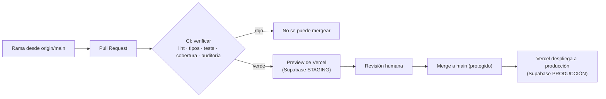

# Despliegue

Cómo llega el código a producción. Basado en las decisiones **D3** (previews por PR como staging) y **D4** (un proyecto Vercel por app) del PLAN.

## Flujo

- **El CI** (`.github/workflows/ci.yml`) decide si un PR se puede mergear. No tiene `continue-on-error`: si algo falla, queda en rojo.
- **Vercel**, conectado a GitHub, crea un preview en cada PR y despliega a producción cuando algo llega a `main`. No hace falta un workflow de deploy ni tokens de Vercel en GitHub.
- **`main` protegido** hace que a producción solo llegue código que pasó el CI y una revisión.

## Configuración (una vez, computador B)

### 1. Proteger `main` (GitHub)

Hazlo **después** de que el CI haya corrido al menos una vez; si no, el check `verificar` no aparece en la lista.

Settings → Branches → Add rule → `main`:
- ✅ Require a pull request before merging
- ✅ Require status checks to pass → agregar **`verificar`**
- ✅ Require branches to be up to date before merging
- ✅ Do not allow bypassing the above settings

### 2. Supabase: dos proyectos

| Proyecto | Lo usan | Migración |
|---|---|---|
| `rutadecarrera-staging` | previews de Vercel y tus computadores | primero aquí |
| `rutadecarrera-prod` | solo producción | después de mergear a `main` |

Cómo aplicar la migración: [database-schema.md](database-schema.md#aplicar-la-migración).

### 3. Vercel: un proyecto por app

Se crea cuando la app tenga código (TASK 11+). Por cada app (`landing`, `asistente`, `test-disc`):

1. Vercel → Add New Project → importar `esalinascl/rutadecarrera-platform`.
2. **Root Directory**: `apps/<app>`.
3. **Environment Variables**, separadas por entorno:

| Variable | Preview | Production |
|---|---|---|
| `SUPABASE_URL` | staging | producción |
| `SUPABASE_SERVICE_ROLE_KEY` | staging | producción |
| `GEMINI_API_KEY` | clave de desarrollo | clave de producción |
| `GEMINI_MODEL` | (pendiente de decidir) | (pendiente de decidir) |
| `NEXT_PUBLIC_APP_URL` | (URL del preview) | dominio real |

> **Regla D3:** un preview nunca usa claves ni base de datos de producción.

4. Dominio: pendiente de decidir qué dominio sirve a qué app (ver PLAN).

## Revertir un despliegue malo

Vercel → proyecto → Deployments → despliegue anterior que funcionaba → **Promote to Production**. Tarda segundos y no requiere tocar git. Después, corregir con un PR normal.

## Secretos

- Las claves se cargan **solo** en Vercel (y en tu `.env.local` de staging), nunca en el código ni en GitHub.
- Este flujo no necesita ningún secreto en GitHub Actions: el CI no despliega.
